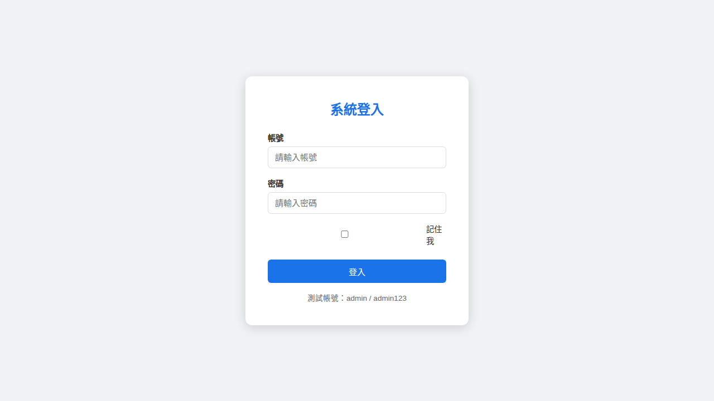
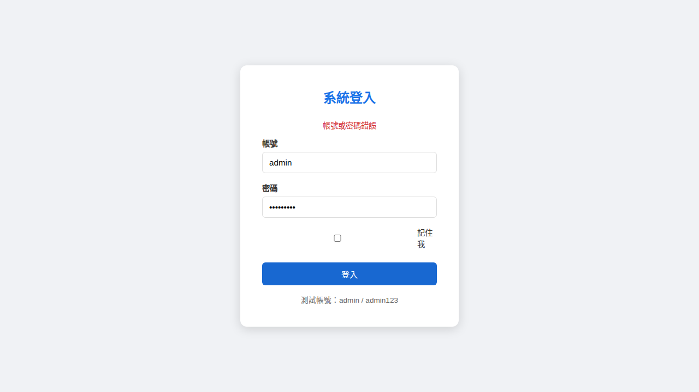
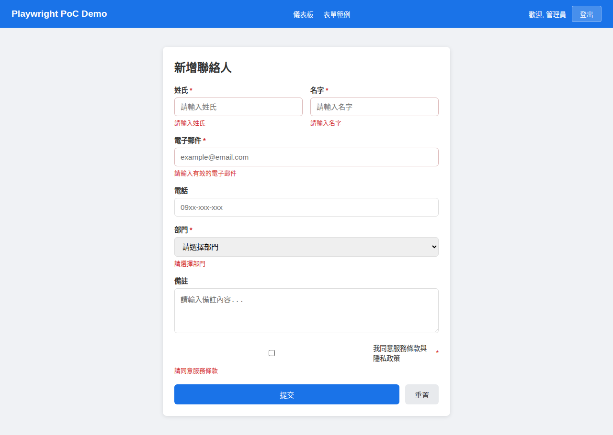
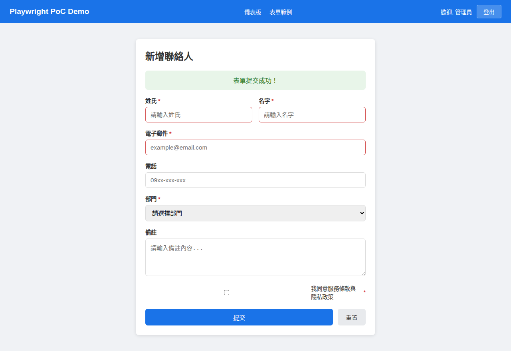

# Playwright + BDD 自動化測試 PoC

企業級 UI 自動化測試框架概念驗證（Proof of Concept），整合 Playwright、BDD (Cucumber/Gherkin)、Page Object Model，並提供完整的 CI/CD 整合方案，作為上版前 UI 回歸測試的標準參考。

---

## 功能總覽

| # | 功能 | 說明 |
|---|------|------|
| 1 | **BDD / Gherkin 整合** | Given/When/Then 完整流程，中文 Feature Files |
| 2 | **Page Object Model** | 封裝頁面操作，提升可維護性 |
| 3 | **多瀏覽器測試** | Chromium / Firefox / WebKit |
| 4 | **行動裝置模擬** | iPhone 13 / Pixel 5 / iPad Mini |
| 5 | **截圖與錄影** | 失敗自動截圖、全程錄影 |
| 6 | **API Mocking / Intercept** | Route 攔截、Mock 回應 |
| 7 | **表單驗證測試** | 必填欄位、格式驗證、錯誤提示 |
| 8 | **Visual Regression** | 像素比對截圖差異 |
| 9 | **無障礙測試 (a11y)** | axe-core WCAG 2.1 AA 標準 |
| 10 | **效能指標蒐集** | 頁面載入時間、Web Vitals |
| 11 | **平行執行** | Worker-based 平行測試 |
| 12 | **測試資料管理** | Data-driven testing、Scenario Outline |
| 13 | **Custom Fixtures** | 認證狀態重用、Page Object 自動注入 |
| 14 | **多環境設定** | Local / SIT / UAT / Staging 切換 |
| 15 | **企業級報告** | HTML Report + JSON Report |
| 16 | **CI/CD 整合** | PR Gate + Nightly + Release Gate |
| 17 | **Docker 容器化** | 一致的測試執行環境 |
| 18 | **Kind K8s CI/CD** | Kubernetes 叢集中執行測試 |

---

## 快速開始

### 前置需求

- Node.js >= 18
- npm >= 9

### 安裝與設定

```bash
# 複製專案
git clone https://github.com/ChunPingWang/playwright-poc.git
cd playwright-poc

# 一鍵初始化（安裝依賴 + 瀏覽器 + 產生 BDD 檔案）
bash scripts/setup.sh

# 或手動安裝
npm ci
npx playwright install --with-deps
npx bddgen --config config/playwright.config.ts
```

### 執行測試

```bash
# 冒煙測試（快速驗證，約 30 秒）
npm run test:smoke

# BDD 測試（33 個測試案例）
npm run test:bdd

# E2E 測試（18 個測試案例）
npm run test:e2e

# 全部測試
npm run test:all

# 使用腳本執行（支援更多選項）
bash scripts/run-tests.sh --smoke           # 冒煙測試
bash scripts/run-tests.sh --regression      # 完整回歸
bash scripts/run-tests.sh --visual          # 視覺回歸
bash scripts/run-tests.sh --a11y            # 無障礙測試
bash scripts/run-tests.sh --browser firefox # 指定瀏覽器
```

### 查看報告

```bash
# HTML 報告
npm run report:html

# 測試結果摘要
bash scripts/generate-report.sh summary
```

---

## Demo App 截圖

本 PoC 包含一個簡易的 Demo Web App 作為測試標的：

### 登入頁面


### 登入失敗 - 錯誤提示


### 儀表板


### 表單 - 驗證錯誤


### 表單 - 提交成功


---

## 專案結構

```
playwright-poc/
├── .github/workflows/           # CI/CD 工作流程
│   ├── ui-test-pr.yml           # PR 觸發的 Smoke 測試
│   ├── ui-test-nightly.yml      # 每日排程完整回歸
│   └── ui-test-release-gate.yml # Release Gate（上版前閘門）
├── src/demo-app/                # Demo Web App（測試標的）
│   ├── login.html               # 登入頁面
│   ├── dashboard.html           # 儀表板頁面
│   ├── form.html                # 表單頁面
│   ├── api-mock-server.js       # Mock API Server (Express)
│   └── styles.css               # 共用樣式
├── tests/
│   ├── features/                # BDD Feature Files (Gherkin)
│   │   ├── login.feature        # 登入測試
│   │   ├── navigation.feature   # 頁面導覽測試
│   │   ├── form-validation.feature # 表單驗證測試
│   │   ├── dashboard.feature    # 儀表板測試
│   │   ├── api-intercept.feature # API 攔截測試
│   │   ├── visual-regression.feature # 視覺回歸測試
│   │   ├── accessibility.feature # 無障礙測試
│   │   └── performance.feature  # 效能測試
│   ├── steps/                   # Step Definitions
│   ├── pages/                   # Page Object Model
│   │   ├── base.page.ts         # 基底頁面（共用方法）
│   │   ├── login.page.ts        # 登入頁面物件
│   │   ├── dashboard.page.ts    # 儀表板頁面物件
│   │   └── form.page.ts         # 表單頁面物件
│   ├── e2e/                     # 純 Playwright 測試
│   │   ├── smoke.spec.ts        # 冒煙測試
│   │   ├── cross-browser.spec.ts # 跨瀏覽器測試
│   │   ├── mobile-responsive.spec.ts # 行動裝置測試
│   │   └── parallel-demo.spec.ts # 平行執行展示
│   ├── fixtures/                # Custom Fixtures
│   └── helpers/                 # 工具函式
├── config/
│   ├── playwright.config.ts     # BDD 測試設定
│   ├── playwright.e2e.config.ts # E2E 測試設定
│   ├── playwright.ci.config.ts  # CI 專用設定
│   ├── cucumber.js              # Cucumber 設定
│   └── environments.ts          # 多環境設定
├── docker/
│   ├── Dockerfile               # 測試容器映像
│   ├── Dockerfile.app           # Demo App 輕量容器
│   └── docker-compose.yml       # 容器編排
├── k8s/                         # Kubernetes Manifests
│   ├── namespace.yaml           # playwright-tests 命名空間
│   ├── demo-app-deployment.yaml # Demo App Deployment
│   ├── demo-app-service.yaml    # ClusterIP Service
│   ├── test-pvc.yaml            # 報告持久化 PVC
│   ├── test-configmap.yaml      # 共用設定 ConfigMap
│   ├── test-job-smoke.yaml      # Smoke 測試 Job
│   ├── test-job-regression.yaml # 回歸測試 Job
│   ├── test-job-full.yaml       # 完整測試 Job
│   └── kind-cluster.yaml        # Kind 叢集設定（可選）
├── config/
│   ├── playwright.config.ts     # BDD 測試設定
│   ├── playwright.e2e.config.ts # E2E 測試設定
│   ├── playwright.ci.config.ts  # CI 專用設定
│   ├── playwright.k8s.config.ts # K8s BDD 測試設定
│   ├── playwright.e2e.k8s.config.ts # K8s E2E 測試設定
│   ├── cucumber.js              # Cucumber 設定
│   └── environments.ts          # 多環境設定
├── scripts/
│   ├── setup.sh                 # 環境初始化
│   ├── run-tests.sh             # 測試執行
│   ├── kind-test.sh             # Kind K8s 測試編排
│   ├── generate-report.sh       # 報告產生
│   └── release-gate-check.sh    # Release Gate 判斷
└── README.md
```

---

## 技術棧

| 技術 | 用途 |
|------|------|
| [Playwright](https://playwright.dev/) | UI 自動化測試核心 |
| [playwright-bdd](https://github.com/vitalets/playwright-bdd) | Playwright + Cucumber 整合 |
| [TypeScript](https://www.typescriptlang.org/) | 型別安全 |
| [@axe-core/playwright](https://github.com/dequelabs/axe-core-npm) | 無障礙測試 (WCAG 2.1 AA) |
| [Express](https://expressjs.com/) | Demo App & Mock API |
| [Docker](https://www.docker.com/) | 容器化測試執行 |
| [Kind](https://kind.sigs.k8s.io/) | Kubernetes in Docker（本地 K8s 叢集） |
| [Kubernetes](https://kubernetes.io/) | 容器編排（Job、Deployment、Service） |

---

## BDD 測試範例

### Feature File (Gherkin 語法)

```gherkin
@smoke @regression
Feature: 使用者登入
  作為一個系統使用者
  我想要能夠使用帳號密碼登入系統

  Scenario: 使用正確帳密登入成功
    Given 我在登入頁面
    When 我輸入帳號 "admin" 和密碼 "admin123"
    And 我點擊登入按鈕
    Then 我應該被導向到儀表板頁面

  Scenario Outline: 多組帳號登入測試 (Data-Driven)
    Given 我在登入頁面
    When 我輸入帳號 "<username>" 和密碼 "<password>"
    And 我點擊登入按鈕
    Then 登入結果應該是 "<result>"

    Examples:
      | username | password  | result |
      | admin    | admin123  | 成功   |
      | user     | user123   | 成功   |
      | admin    | wrong     | 失敗   |
```

### Step Definition

```typescript
When('我輸入帳號 {string} 和密碼 {string}', async ({ page }, username, password) => {
  const loginPage = new LoginPage(page);
  await loginPage.fillUsername(username);
  await loginPage.fillPassword(password);
});
```

### Page Object Model

```typescript
export class LoginPage extends BasePage {
  async login(username: string, password: string): Promise<void> {
    await this.fill('#username', username);
    await this.fill('#password', password);
    await this.click('#login-btn');
  }
}
```

---

## Tag 策略

| Tag | 用途 | 執行時機 |
|-----|------|----------|
| `@smoke` | 冒煙測試 | PR Gate、每次部署後 |
| `@regression` | 完整回歸 | Nightly、Release Gate |
| `@visual` | 視覺比對 | Release Gate |
| `@a11y` | 無障礙測試 | Release Gate |
| `@performance` | 效能測試 | Nightly |
| `@critical` | 關鍵路徑 | 所有階段 |

---

## CI/CD 整合 - 三層測試策略

```
┌─────────────────────────────────────────────────────┐
│                  CI/CD Pipeline                      │
│                                                      │
│  ┌──────────┐   ┌──────────────┐   ┌──────────────┐ │
│  │ PR Gate  │──▶│  Nightly     │──▶│ Release Gate │ │
│  │ (快速)   │   │  (完整回歸)  │   │ (上版閘門)   │ │
│  └──────────┘   └──────────────┘   └──────────────┘ │
│                                                      │
│  ● Smoke Test   ● Full Regression  ● Full + Visual  │
│  ● 單瀏覽器    ● 多瀏覽器        ● 多瀏覽器       │
│  ● < 5 min     ● < 30 min        ● < 30 min       │
│  ● @smoke tag  ● All features    ● All + a11y     │
│  ● Block PR    ● Report only     ● Block Release  │
│                                                      │
│  觸發: PR 建立   觸發: 每日排程    觸發: release/*  │
└─────────────────────────────────────────────────────┘
```

### PR Gate (`ui-test-pr.yml`)
- **觸發條件**：PR 建立或更新
- **測試範圍**：`@smoke` 標籤的 BDD 測試 + E2E Smoke 測試
- **瀏覽器**：Chromium（單瀏覽器，快速執行）
- **用途**：快速驗證基本功能，阻擋有問題的 PR

### Nightly (`ui-test-nightly.yml`)
- **觸發條件**：週一至週五 UTC 02:00（台灣時間 10:00）
- **測試範圍**：全部 BDD + E2E 測試
- **瀏覽器**：Chromium / Firefox / WebKit（多瀏覽器矩陣）
- **用途**：每日完整回歸，及早發現問題

### Release Gate (`ui-test-release-gate.yml`)
- **觸發條件**：Push 到 `release/*` 分支
- **測試範圍**：全部測試（含 Visual Regression + a11y）
- **通過條件**：測試通過率 >= 95%
- **用途**：上版前閘門，確保品質達標才允許發佈

### Release Gate 判斷流程

```
執行全部測試 ──▶ 解析 JSON 報告 ──▶ 計算通過率
                                        │
                                  ┌─────▼──────┐
                                  │ 通過率 ≥ 95%? │
                                  └──┬──────┬───┘
                                 Yes │      │ No
                               ┌─────▼┐  ┌──▼─────┐
                               │ 放行  │  │ 攔截   │
                               │ 上版  │  │ 修復後 │
                               │      │  │ 重測   │
                               └──────┘  └────────┘
```

---

## Docker 使用

```bash
# BDD 測試
docker-compose -f docker/docker-compose.yml run test-bdd

# E2E 測試
docker-compose -f docker/docker-compose.yml run test-e2e

# Smoke 測試
docker-compose -f docker/docker-compose.yml run test-smoke

# 全部測試（多瀏覽器）
docker-compose -f docker/docker-compose.yml run test-all
```

---

## Kind Kubernetes 測試

在本地 Kind Kubernetes 叢集中執行 Playwright 測試，模擬真實的 K8s CI/CD 環境。

### 前置需求

- Docker
- [Kind](https://kind.sigs.k8s.io/) v0.24.0+
- kubectl

### 架構

```
Kind Cluster
└── Namespace: playwright-tests
    ├── Deployment: demo-app          ← Express Demo App (node:20-alpine, ~50MB)
    ├── Service: demo-app-svc         ← ClusterIP :3000
    ├── ConfigMap: test-config        ← BASE_URL、CI、TEST_ENV
    ├── PVC: test-reports-pvc         ← 500Mi 報告持久化
    └── Job: test-smoke/regression/full  ← Playwright 測試執行器
```

### 執行測試

```bash
# 冒煙測試（@smoke 標籤，最快）
bash scripts/kind-test.sh --smoke

# 回歸測試（全部 BDD 測試）
bash scripts/kind-test.sh --regression

# 完整測試（BDD + E2E）
bash scripts/kind-test.sh --full

# 指定叢集名稱
bash scripts/kind-test.sh --smoke --cluster my-cluster

# 跳過映像建置（使用既有映像）
bash scripts/kind-test.sh --smoke --skip-build

# 或透過 run-tests.sh 呼叫
bash scripts/run-tests.sh --kind --smoke
```

### 清理資源

```bash
bash scripts/kind-test.sh --clean
```

### 報告收集

測試完成後報告會自動收集到 `reports/k8s/` 目錄，包含：
- `results.json` — JSON 格式測試結果（供 Release Gate 判斷）
- `html-report/` — Playwright HTML 報告
- `test-results/` — 測試產出物（截圖、錄影等）

### 建立專屬叢集（可選）

若不想使用既有叢集，可建立專屬的 Kind 叢集：

```bash
kind create cluster --config k8s/kind-cluster.yaml
bash scripts/kind-test.sh --smoke --cluster playwright-poc
```

### 關鍵設計

- **兩個映像分離**：Demo App 使用 `node:20-alpine`（輕量），測試用 `mcr.microsoft.com/playwright`（完整）
- **`imagePullPolicy: Never`**：Kind 透過 `kind load docker-image` 載入本機映像
- **`/dev/shm` 掛載**：所有 Job 掛載 256Mi Memory emptyDir，避免 Chromium 共享記憶體不足
- **移除 `webServer`**：K8s 中 Demo App 是獨立 Deployment，Playwright 設定不需自動啟動 server

---

## 多環境設定

透過 `TEST_ENV` 環境變數切換測試環境：

```bash
# 本機開發
TEST_ENV=local npm run test:bdd

# SIT 環境
TEST_ENV=sit BASE_URL=https://sit.example.com npm run test:bdd

# UAT 環境
TEST_ENV=uat BASE_URL=https://uat.example.com npm run test:bdd
```

設定檔位於 `config/environments.ts`，支援 Local / SIT / UAT / Staging 四種環境。

---

## 測試結果

### 測試摘要

| 項目 | 數量 | 狀態 |
|------|------|------|
| BDD 測試案例 | 33 | 全部通過 |
| E2E 測試案例 | 18 | 全部通過 |
| **總計** | **51** | **100% 通過率** |
| Release Gate | 100% >= 95% | PASS |

### BDD Feature 清單

| Feature | 測試數 | 涵蓋能力 |
|---------|--------|----------|
| 使用者登入 | 9 | 正常登入、錯誤登入、Data-Driven |
| 頁面導覽 | 4 | 導覽、登出、未授權存取 |
| 表單驗證 | 4 | 空白提交、完整提交、無效格式、重置 |
| 儀表板 | 4 | 統計資料、圖表、訂單表格 |
| API 攔截 | 3 | Mock 回應、錯誤模擬、請求監控 |
| 視覺回歸 | 3 | 登入頁、儀表板、表單頁截圖比對 |
| 無障礙測試 | 3 | WCAG 2.1 AA 三頁面檢查 |
| 效能指標 | 3 | 載入時間、Web Vitals |

---

## 架構決策紀錄 (ADR)

### ADR-001: 選擇 playwright-bdd 整合 BDD

**決策**：使用 `playwright-bdd` 而非原生 `@cucumber/cucumber` + Playwright 組合。

**原因**：
- `playwright-bdd` 直接在 Playwright Test Runner 內執行 BDD 測試，不需額外的 Cucumber 執行器
- 完整支援 Playwright 的平行執行、Reporter、Fixture 等功能
- Step Definition 可直接存取 Playwright 的 `page`、`request` 等 fixture
- 維護單一測試框架設定，降低複雜度

### ADR-002: BDD + 純 Playwright 並行

**決策**：同時保留 BDD（Feature Files）和純 Playwright（spec files）兩種測試寫法。

**原因**：
- BDD 適合業務邏輯驗證，讓 PO/QA 可讀的 Gherkin 語法
- 純 Playwright 適合技術面測試（跨瀏覽器、RWD、平行執行展示）
- 給團隊展示兩種方式的優劣，由團隊決定實際專案的策略

### ADR-003: 獨立 E2E 設定檔

**決策**：BDD 測試和 E2E 測試使用獨立的 Playwright 設定檔。

**原因**：
- `playwright-bdd` 的 `defineBddConfig()` 會設定 `testDir` 為產生的測試檔目錄
- 純 Playwright spec 檔案位於不同目錄，需要獨立的 `testDir` 設定
- 分離設定檔讓各自的設定更清晰，也支援獨立執行

### ADR-004: Tag-Based 測試分層

**決策**：使用 Gherkin Tag 實現測試分層（Smoke / Regression / Visual / a11y）。

**原因**：
- Tag 是 BDD 標準的分類機制，語義清晰
- Playwright 原生支援 `--grep` 參數過濾 Tag
- CI/CD 可根據不同場景執行對應 Tag 的測試子集
- 同一個測試可擁有多個 Tag（如 `@smoke @critical`），靈活組合

### ADR-005: Kind Kubernetes CI/CD 整合

**決策**：使用 Kind（Kubernetes in Docker）在本地模擬 K8s 叢集執行測試。

**原因**：
- Kind 輕量、快速，適合本地開發和 CI 環境
- 使用標準 K8s Manifests（Deployment、Service、Job），可直接移植到正式 K8s 環境
- Demo App 和 Test Runner 分離為獨立 Pod，模擬真實微服務架構
- Job 的 `backoffLimit: 0` 和 `restartPolicy: Never` 確保測試失敗不會重複執行
- PVC 持久化報告，透過 `kubectl cp` 收集至本機

---

## 常用指令參考

```bash
# 啟動 Demo App
npm run app:start

# 測試指令
npm run test:smoke     # 冒煙測試
npm run test:bdd       # BDD 測試
npm run test:e2e       # E2E 測試
npm run test:all       # 全部測試
npm run test:visual    # 視覺回歸
npm run test:a11y      # 無障礙測試

# 報告
npm run report:html    # 開啟 HTML 報告

# Playwright CLI
npx playwright test --config config/playwright.config.ts --project=chromium
npx playwright test --config config/playwright.config.ts --grep @smoke
npx playwright show-report

# Docker
docker-compose -f docker/docker-compose.yml run test-bdd

# Kind K8s
bash scripts/kind-test.sh --smoke        # 冒煙測試
bash scripts/kind-test.sh --regression   # 回歸測試
bash scripts/kind-test.sh --full         # 完整測試
bash scripts/kind-test.sh --clean        # 清理資源
```

---

## 授權

ISC License
